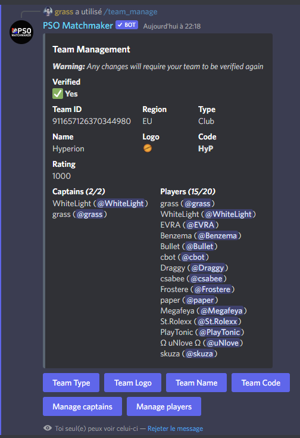
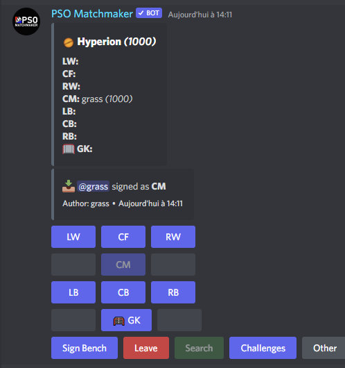

# Description
**pso-matchmaker** is a Discord bot initially developped for the game [Pro Soccer Online](https://store.steampowered.com/app/1583320/Pro_Soccer_Online/).
<br>You are free to fork it and use it for your own purpose, by adapting some of the text content in the code.

The purpose of this bot is to help players looking for competitive games to find matches and build up their own team.
Use the **/help** command to see a list of useful commands and how to use the bot.

# Features

## Ranked mode
**pso-matchmaker** implements an **Elo ranking system** that rates both teams and players depending on their match results.<br>
The ratings are region-specific (4 regions exist so far: Europe, North America, South America and East Asia).<br>
You can display the teams and players leaderboard by using the **/leaderboard** command.<br>
To see your own stats, use the **/player_stats** command.<br>
Every game mode supports ranked mode *(read [Game modes section](#game-modes) for more information)*. However, only the **official community discords** are allowed to create a ranked line-up. 

<br>
*(Team leaderboard)*

<br>
*(Players leaderboard)*

## Auto-matchmaking
If you want **pso-matchmaker** to automatically search for a match that is matching your team level, you can enable the auto-matchmaking feature when you create your line-up (active by default, and only available for the Team mode).

Once a match has been found, a message is sent in both the channel and each player DM.<br>
<br>
*(Searching for a match)*

<br>
*(Message sent in the channel once a match is found)*

<br>
*(Direct Message sent to the players when the match starts)*

## Team Management
**pso-matchmaker** lets you create your own team (wether it is competitive, a group of friends or a community !), and then manage it with many game modes and options.

The 2 most important things to understand are:
- **1 Discord Server (Guild) = 1 Team** 
- **1 Discord Channel = 1 Line-up**

A Team is made of 1 or multiple line-ups.<br>
To create your team, invite **pso-matchmaker** on your discord, then use **/register_team** command.
To create a new line-up, use **/setup_lineup**, **/setup_mix** or **/setup_mix_captains** commands depending on the game mode you want to play with this line-up *(read [Game modes section](#game-modes) for more information)*

Once you create your team, you can use the **/team_manage** command to edit various information.

<br>
*(Example of team management)*

## Game modes
There are 3 different game modes available !<br>
***Note**: At any time, if you want to display and interact with the line-up, you can use the **/status** command.*

### Team
The most interesting and competitive game mode is the **team mode**.<br>
To use this mode, you need to setup a channel with the **/setup_lineup** command.<br>
The team mode let you select a position and group up with your teamates, then either pick a team/mix to challenge by clicking the **Challenge** button, or simply click on **Search** and let **pso-matchmaker** find a match for you.

<br>
*(Example of a team line-up)*

### Mix
This game mode brings up a **Red Team** and a **Blue Team** in the same channel.<br>
To use this mode, you need to setup a channel with the **/setup_mix** command.<br>
This is very interesting if you have a community discord server and want people to play against each other.<br>
When you create a mix line-up, you have an option called **allow_teams** which, if set to true, allow team line-ups to face the **Red Team** of the mix !

<br>
*(Example of a mix line-up)*

### Mix Captains (Draft mode)
This game mode brings up a single queue that players can join in. Once enough players have joined the queue, a draft starts and 2 captains are chosent to pick there players for there team.

<br>
*(Example of a mix captains line-up)*

# How to run the bot locally
- Install [NPM](https://www.npmjs.com/) and [NodeJS](https://nodejs.org/en/)
- Build the project using `npm run build`
- Create a **.env** file in the project root directory with at least the following variables
```
CLIENT_ID=<BOT CLIENT ID>
TOKEN=<BOT TOKEN ID>
MONGO_URI=<MONGO URI>
```
An additional **GUILD_ID** env variable can be used to deploy the commands on a specific guild (useful for test environment)
- Deploy the commands using `node build/scripts/deploys-commands.js`
- Start the bot with nodemon using `npm run dev`